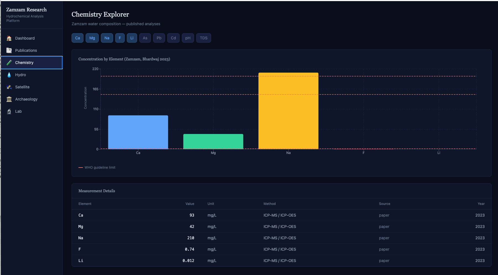
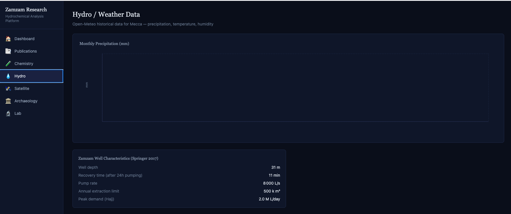
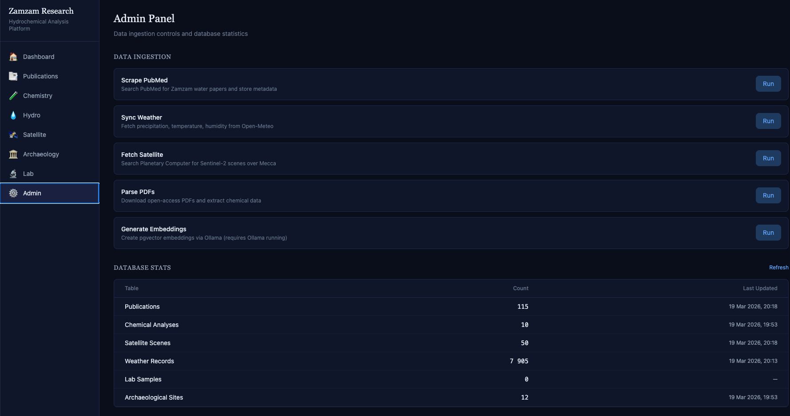
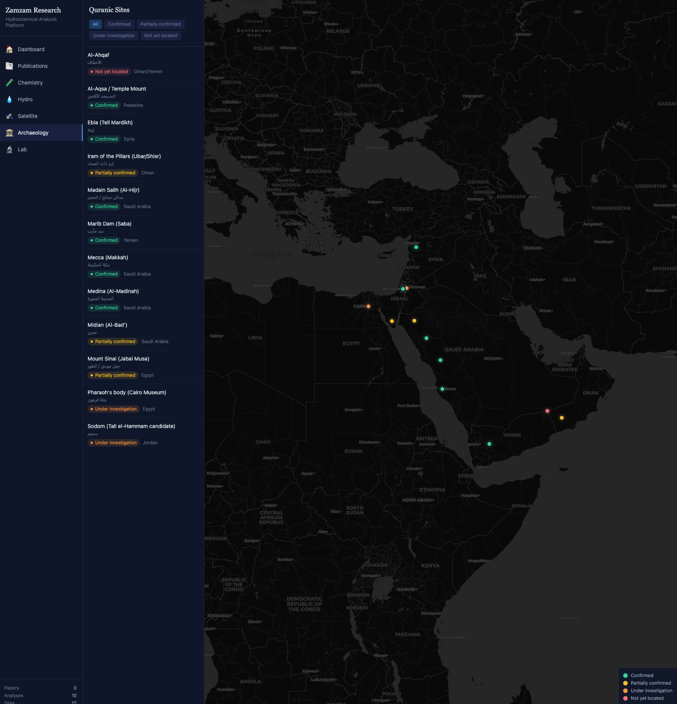

# zamzam-research

> Independent scientific research platform for hydrochemical analysis of Zamzam water and archaeological verification of Quranic historical sites.

## Current status (v0.3.0)

| Dataset | Count | Source |
|---------|-------|--------|
| Publications | 51 relevant (115 scraped) | PubMed (Entrez API) |
| Chemical analyses | 177 measurements, 16 sources | 5 Zamzam studies + 11 comparison waters |
| Satellite scenes | 50 | Sentinel-2 L2A via Planetary Computer |
| Archaeological sites | 12 | Literature compilation |
| Weather records | 7,905 | Open-Meteo (2019–2026) |

### Water sources (16)

| Source | Type | TDS (mg/L) | Origin |
|--------|------|-----------|--------|
| Bhardwaj 2023 | Zamzam | 813 | Masjid Al-Haram, Mecca |
| Donia 2021 | Zamzam | 835 | Bottled, Saudi Arabia |
| Shomar 2012 | Zamzam | 980 | Well direct sampling |
| Al-Gamal 2009 | Zamzam | 1090 | Well, Mecca |
| EJEBA 2025 | Zamzam | 900 | Literature review aggregate |
| Evian | Mineral | 309 | Evian-les-Bains, France |
| Vittel | Mineral | 846 | Vosges, France |
| Volvic | Mineral | 130 | Puy-de-Dome, France |
| San Pellegrino | Mineral | 854 | Lombardy, Italy |
| Perrier | Mineral | 475 | Vergeze, France |
| Gerolsteiner | Mineral | 2527 | Eifel, Germany |
| Fiji Water | Mineral | 222 | Yaqara Valley, Fiji |
| Acqua Panna | Mineral | 188 | Tuscany, Italy |
| Highland Spring | Mineral | 124 | Perthshire, UK |
| Spa Reine | Mineral | 33 | Spa, Belgium |
| Luxembourg tap | Tap water | 310 | Luxembourg City (SEBES) |

## Quick start

```bash
git clone https://github.com/nabz0r/zamzam-research.git
cd zamzam-research
make setup          # docker compose + deps + migrations + seed
make api            # API at http://localhost:8000
make dashboard      # Frontend at http://localhost:5173
```

### Post-setup data ingestion

```bash
make ingest          # Scrape PubMed publications
make sync-hydro      # Fetch weather data (Open-Meteo)
make fetch-satellite # Search Sentinel-2 scenes
make classify        # Classify papers by relevance
make export          # Generate CSV/JSON dataset exports
```

### Manual setup

```bash
cp .env.example .env
docker compose up -d                        # PostgreSQL + Redis + Ollama
pip install -r requirements.txt
PYTHONPATH=. alembic upgrade head
PYTHONPATH=. python3 scripts/seed_known_data.py
PYTHONPATH=. uvicorn api.main:app --reload   # API at :8000
cd dashboard && npm install && npm run dev    # Frontend at :5173
```

## Architecture

```
┌─────────────────────────────────────────────────────────┐
│                 DATA INGESTION LAYER                    │
│  PubMed/Entrez │ Sentinel-2/STAC │ Open-Meteo │ Lab CSV │
└───────────────────────────┬─────────────────────────────┘
                            │
                 ┌──────────▼──────────┐
                 │  FastAPI + Celery   │◄── Redis (queue)
                 │  Workers & Scheduler│
                 └──────────┬──────────┘
                            │
┌───────────────────────────▼─────────────────────────────┐
│              PostgreSQL + pgvector                       │
│  publications │ chemical_analyses │ satellite_data       │
│  hydro_monitoring │ lab_samples │ archaeological_sites   │
└───────────────────────────┬─────────────────────────────┘
                            │
                 ┌──────────▼──────────┐
                 │  React Dashboard    │
                 │  Recharts + Leaflet │
                 └─────────────────────┘
```

## API endpoints

### Publications
| Method | Endpoint | Description |
|--------|----------|-------------|
| GET | `/api/v1/publications` | List publications (paginated, `relevant_only=true`) |
| GET | `/api/v1/publications/search?q=&mode=auto` | Text/semantic search (pgvector fallback) |
| GET | `/api/v1/publications/{id}` | Single publication detail |

### Chemistry
| Method | Endpoint | Description |
|--------|----------|-------------|
| GET | `/api/v1/chemistry/sources` | Distinct sample sources with counts |
| GET | `/api/v1/chemistry/elements` | All distinct elements with stats |
| GET | `/api/v1/chemistry/by-element/{symbol}` | All measurements for an element |
| GET | `/api/v1/chemistry/compare?elements=Ca,Mg&sources=zamzam,evian` | Multi-source comparison |

### Hydro / Weather
| Method | Endpoint | Description |
|--------|----------|-------------|
| GET | `/api/v1/hydro/rainfall?resolution=monthly` | Rainfall data (daily or monthly) |
| GET | `/api/v1/hydro/stats` | Annual totals, monthly averages, temperature |

### Satellite
| Method | Endpoint | Description |
|--------|----------|-------------|
| GET | `/api/v1/satellite/scenes` | Sentinel-2 scene metadata |
| GET | `/api/v1/satellite/stats` | Summary statistics |

### Archaeology
| Method | Endpoint | Description |
|--------|----------|-------------|
| GET | `/api/v1/archaeology/sites` | All sites as GeoJSON FeatureCollection |
| GET | `/api/v1/archaeology/sites/{id}` | Single site detail |

### Lab
| Method | Endpoint | Description |
|--------|----------|-------------|
| GET | `/api/v1/lab/samples` | List lab samples with status |
| POST | `/api/v1/lab/samples` | Create sample batch |
| POST | `/api/v1/lab/samples/{id}/results` | Upload CSV results |
| GET | `/api/v1/lab/samples/{id}/report` | Formatted results |

### Admin
| Method | Endpoint | Description |
|--------|----------|-------------|
| GET | `/api/v1/admin/stats` | Table counts + last updated timestamps |

### Task triggers
| Method | Endpoint | Description |
|--------|----------|-------------|
| POST | `/api/v1/tasks/ingest-papers` | Scrape PubMed |
| POST | `/api/v1/tasks/fetch-satellite` | Search Planetary Computer |
| POST | `/api/v1/tasks/parse-pdfs` | Download + parse OA PDFs |
| POST | `/api/v1/tasks/generate-embeddings` | Generate pgvector embeddings (requires Ollama) |
| POST | `/api/v1/tasks/sync-hydro` | Sync weather data from Open-Meteo |

## Dataset

The `exports/` directory contains the full chemical composition dataset:

| File | Description |
|------|-------------|
| `zamzam_chemical_dataset.csv` | 177 measurements — element, value, unit, source, year, method |
| `zamzam_meta_analysis_summary.json` | Per-source per-element statistics (mean, std, CV%) |
| `README_dataset.md` | Dataset description, methodology, suggested citation |

Regenerate with `make export`.

## Project structure

```
zamzam-research/
├── api/
│   ├── config.py                  # pydantic-settings configuration
│   ├── database.py                # SQLAlchemy async engine
│   ├── main.py                    # FastAPI app + task endpoints
│   ├── models/
│   │   ├── publication.py               # pgvector embedding column
│   │   ├── chemical_analysis.py         # normalized: 1 row/element/sample
│   │   ├── satellite_data.py            # bbox_wkt (PostGIS deferred)
│   │   ├── hydro_monitoring.py          # time series
│   │   ├── lab_sample.py               # batch tracking
│   │   └── archaeological_site.py       # GeoJSON support
│   ├── routers/
│   │   ├── publications.py        # list, search, detail
│   │   ├── chemistry.py           # elements, compare, sources
│   │   ├── hydro.py               # rainfall, stats
│   │   ├── satellite.py           # scenes, stats
│   │   ├── archaeology.py         # GeoJSON sites
│   │   ├── lab.py                 # CRUD + CSV upload
│   │   └── admin.py               # stats dashboard
│   ├── services/
│   │   ├── pubmed_scraper.py           # Biopython Entrez
│   │   ├── pdf_parser.py               # PyMuPDF + tabula + LLM fallback
│   │   ├── satellite_fetcher.py        # Planetary Computer STAC
│   │   ├── weather_fetcher.py          # Open-Meteo Archive API
│   │   └── embeddings.py               # Ollama REST → pgvector
│   └── tasks/
│       ├── celery_app.py          # broker config + beat schedule
│       ├── ingest_papers.py       # weekly PubMed scrape
│       └── sync_hydro.py          # daily weather sync
├── dashboard/
│   └── src/
│       ├── App.jsx
│       ├── components/
│       │   ├── Home.jsx               # stats dashboard
│       │   ├── PaperSearch.jsx        # publication search
│       │   ├── ChemExplorer.jsx       # bar charts + radar + heatmap + WHO table
│       │   ├── HydroView.jsx          # rainfall charts + heatmap
│       │   ├── SatelliteViewer.jsx    # Leaflet + scene footprints
│       │   ├── ArchaeoMap.jsx         # Leaflet + colored markers
│       │   ├── ResearchView.jsx       # key findings + WHO compliance + gaps
│       │   ├── LabTracker.jsx         # kanban board
│       │   └── AdminPanel.jsx         # table stats + data actions
│       └── utils/api.js
├── notebooks/
│   ├── 01_literature_review.ipynb
│   ├── 02_chemical_meta_analysis.ipynb
│   └── 03_satellite_wadi_ibrahim.ipynb
├── data/reference/                # tracked seed data + manual_compositions.json
├── scripts/
│   ├── seed_known_data.py         # idempotent seeder
│   ├── classify_papers.py         # relevance classification
│   ├── export_dataset.py          # CSV/JSON dataset export
│   └── fetch_satellite_demo.py
├── exports/                       # generated dataset files
├── docs/
│   ├── SAMPLING_PROTOCOL.md
│   ├── CONTRIBUTING.md
│   ├── draft_abstract.md
│   ├── screenshots/
│   └── figures/
├── alembic/                       # migrations
├── docker-compose.yml             # PostgreSQL + Redis + Ollama
├── Makefile
├── CHANGELOG.md
├── requirements.txt
└── .env.example
```

## Screenshots

| Chemistry Explorer (radar + heatmap) | Research Page |
|---|---|
|  |  |

| Satellite Viewer | Hydro / Weather |
|---|---|
|  |  |

| Admin Panel | Archaeology Map |
|---|---|
|  |  |

## License

MIT — Open science, open source.

---

*"Afala yandhuruna" — "Do they not look?" (Quran 88:17)*
