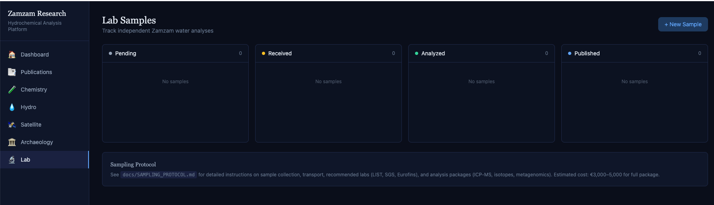

# zamzam-research

> Independent scientific research platform for hydrochemical analysis of Zamzam water and archaeological verification of Quranic historical sites.

## Current status

| Dataset | Count | Source |
|---------|-------|--------|
| Publications | 115 | PubMed (Entrez API) |
| Chemical analyses | 12 | Seed data + PDF extraction |
| Satellite scenes | 5 | Sentinel-2 L2A via Planetary Computer |
| Archaeological sites | 12 | Literature compilation |
| Weather records | 7,905 | Open-Meteo (2019–2026) |

## Quick start

```bash
git clone https://github.com/nabz0r/zamzam-research.git
cd zamzam-research
make setup          # docker compose + deps + migrations + seed
make api            # API at http://localhost:8000
make dashboard      # Frontend at http://localhost:5173
```

Or manually:

```bash
cp .env.example .env
docker compose up -d                        # PostgreSQL + Redis + Ollama
pip install -r requirements.txt
PYTHONPATH=. alembic upgrade head
PYTHONPATH=. python scripts/seed_known_data.py
PYTHONPATH=. uvicorn api.main:app --reload   # API at :8000
cd dashboard && npm install && npm run dev    # Frontend at :5173
```

## Architecture

```
┌─────────────────────────────────────────────────────────┐
│                 DATA INGESTION LAYER                    │
│  PubMed/Entrez │ Sentinel-2/STAC │ Open-Meteo │ Lab CSV │
└───────────────────────────┬─────────────────────────────┘
                            │
                 ┌──────────▼──────────┐
                 │  FastAPI + Celery   │◄── Redis (queue)
                 │  Workers & Scheduler│
                 └──────────┬──────────┘
                            │
┌───────────────────────────▼─────────────────────────────┐
│              PostgreSQL + pgvector                       │
│  publications │ chemical_analyses │ satellite_data       │
│  hydro_monitoring │ lab_samples │ archaeological_sites   │
└───────────────────────────┬─────────────────────────────┘
                            │
                 ┌──────────▼──────────┐
                 │  React Dashboard    │
                 │  Recharts + Leaflet │
                 └─────────────────────┘
```

## API endpoints

### Publications
| Method | Endpoint | Description |
|--------|----------|-------------|
| GET | `/api/v1/publications` | List publications (paginated, filterable by year/journal) |
| GET | `/api/v1/publications/search?q=` | Text search (ilike) with semantic search fallback (pgvector) |
| GET | `/api/v1/publications/{id}` | Single publication detail |

### Chemistry
| Method | Endpoint | Description |
|--------|----------|-------------|
| GET | `/api/v1/chemistry/elements` | All distinct elements with stats |
| GET | `/api/v1/chemistry/by-element/{symbol}` | All measurements for an element |
| GET | `/api/v1/chemistry/compare?elements=Ca,Mg,Na` | Comparison data (Recharts format) |

### Hydro / Weather
| Method | Endpoint | Description |
|--------|----------|-------------|
| GET | `/api/v1/hydro/rainfall?resolution=monthly` | Rainfall data (daily or monthly) |
| GET | `/api/v1/hydro/stats` | Annual totals, monthly averages, temperature |

### Satellite
| Method | Endpoint | Description |
|--------|----------|-------------|
| GET | `/api/v1/satellite/scenes` | Sentinel-2 scene metadata |
| GET | `/api/v1/satellite/stats` | Summary statistics |

### Archaeology
| Method | Endpoint | Description |
|--------|----------|-------------|
| GET | `/api/v1/archaeology/sites` | All sites as GeoJSON FeatureCollection |
| GET | `/api/v1/archaeology/sites/{id}` | Single site detail |

### Lab
| Method | Endpoint | Description |
|--------|----------|-------------|
| GET | `/api/v1/lab/samples` | List lab samples with status |
| POST | `/api/v1/lab/samples` | Create sample batch |
| POST | `/api/v1/lab/samples/{id}/results` | Upload CSV results |
| GET | `/api/v1/lab/samples/{id}/report` | Formatted results |

### Task triggers
| Method | Endpoint | Description |
|--------|----------|-------------|
| POST | `/api/v1/tasks/ingest-papers` | Scrape PubMed |
| POST | `/api/v1/tasks/fetch-satellite` | Search Planetary Computer |
| POST | `/api/v1/tasks/parse-pdfs` | Download + parse OA PDFs |
| POST | `/api/v1/tasks/generate-embeddings` | Generate pgvector embeddings (requires Ollama) |
| POST | `/api/v1/tasks/sync-hydro` | Sync weather data from Open-Meteo |

## Project structure

```
zamzam-research/
├── api/
│   ├── __init__.py
│   ├── config.py              # pydantic-settings configuration
│   ├── database.py            # SQLAlchemy async engine
│   ├── main.py                # FastAPI app + task endpoints
│   ├── models/
│   │   ├── publication.py           # pgvector embedding column
│   │   ├── chemical_analysis.py     # normalized: 1 row/element/sample
│   │   ├── satellite_data.py        # bbox_wkt (PostGIS later)
│   │   ├── hydro_monitoring.py      # time series
│   │   ├── lab_sample.py            # batch tracking
│   │   └── archaeological_site.py   # GeoJSON support
│   ├── routers/
│   │   ├── publications.py    # list, search, detail
│   │   ├── chemistry.py       # elements, compare
│   │   ├── hydro.py           # rainfall, stats
│   │   ├── satellite.py       # scenes, stats
│   │   ├── archaeology.py     # GeoJSON sites
│   │   └── lab.py             # CRUD + CSV upload
│   ├── services/
│   │   ├── pubmed_scraper.py       # Biopython Entrez
│   │   ├── pdf_parser.py           # PyMuPDF + tabula + LLM fallback
│   │   ├── satellite_fetcher.py    # Planetary Computer STAC
│   │   ├── weather_fetcher.py      # Open-Meteo Archive API
│   │   └── embeddings.py          # Ollama REST → pgvector
│   └── tasks/
│       ├── celery_app.py      # broker config + beat schedule
│       ├── ingest_papers.py   # weekly PubMed scrape
│       └── sync_hydro.py      # daily weather sync
├── dashboard/
│   └── src/
│       ├── App.jsx
│       ├── components/
│       │   ├── Home.jsx            # stats dashboard
│       │   ├── PaperSearch.jsx     # publication search
│       │   ├── ChemExplorer.jsx    # Recharts + WHO limits
│       │   ├── HydroView.jsx       # rainfall charts + heatmap
│       │   ├── SatelliteViewer.jsx  # Leaflet + scene footprints
│       │   ├── ArchaeoMap.jsx       # Leaflet + colored markers
│       │   └── LabTracker.jsx       # kanban board
│       └── utils/api.js
├── notebooks/
│   ├── 01_literature_review.ipynb
│   ├── 02_chemical_meta_analysis.ipynb
│   └── 03_satellite_wadi_ibrahim.ipynb
├── data/reference/              # tracked seed data
├── scripts/
│   ├── seed_known_data.py       # idempotent seeder
│   ├── fetch_satellite_demo.py
│   └── init-extensions.sql
├── docs/SAMPLING_PROTOCOL.md
├── alembic/                     # migrations
├── docker-compose.yml           # PostgreSQL + Redis + Ollama
├── Makefile
├── requirements.txt
└── .env.example
```

## Screenshots

| Chemistry Explorer | Archaeology Map |
|---|---|
|  |  |

| Satellite Viewer | Hydro / Weather |
|---|---|
|  |  |

| Lab Tracker |
|---|
|  |

## License

MIT — Open science, open source.

---

*"Afala yandhuruna" — "Do they not look?" (Quran 88:17)*
